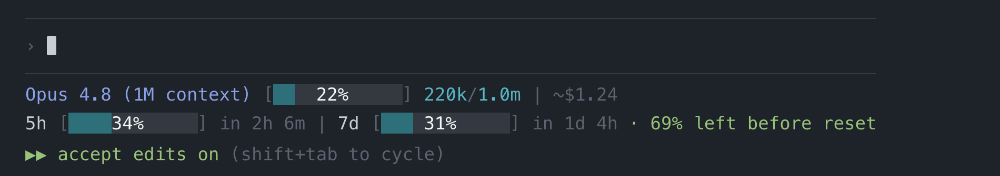

# monclaude

A rich, real-time status line for [Claude Code](https://docs.anthropic.com/en/docs/claude-code). Monitor your context window, usage limits, peak hours, and costs — all without leaving your terminal.

> *mon claude* — "my Claude" in French. Also: **mon**itor **Claude**.



## What you get

```
Opus 4.6 (1M context) | ●●○○○○○○○○ 150k/1.0m (15%) | ~$1.24
5hr ●○○○○○○○○○ 10% in 2h 6m PEAK | 7d ●○○○○○○○○○ 11% in 4d 11h | extra $33.05/$50
```

**Line 1** — Session vitals
- Model name and context size
- Context window usage bar (color-coded green → orange → yellow → red)
- Tokens used vs total with percentage
- Running session cost

**Line 2** — Rate limits & billing
- 5-hour rolling usage with time until reset
- **PEAK** indicator during high-demand hours (weekdays 5–11am PT)
- 7-day rolling usage with time until reset
- Extra credits used / monthly cap (if enabled)

## Install

**One-liner:**

```bash
curl -fsSL https://raw.githubusercontent.com/amirhjalali/monclaude/main/install.sh | bash
```

**Ask Claude to do it:**

Paste this prompt into Claude Code and it will install monclaude for you:

> Download https://raw.githubusercontent.com/amirhjalali/monclaude/main/monclaude.sh to ~/.claude/monclaude.sh, make it executable, ensure jq is installed, and in ~/.claude/settings.json set the statusLine field to {"type": "command", "command": "~/.claude/monclaude.sh"}

**Manual:**

```bash
# Download
curl -fsSL https://raw.githubusercontent.com/amirhjalali/monclaude/main/monclaude.sh -o ~/.claude/monclaude.sh
chmod +x ~/.claude/monclaude.sh

# Configure Claude Code
# Add to ~/.claude/settings.json:
# { "statusLine": { "type": "command", "command": "/path/to/monclaude.sh" } }
```

## Requirements

- [Claude Code](https://docs.anthropic.com/en/docs/claude-code) CLI
- [`jq`](https://jqlang.github.io/jq/) — `brew install jq`
- macOS (uses `security` keychain and BSD `date`/`stat`)
- A Claude Pro, Max, or Team subscription (for usage data)

## How it works

1. Claude Code pipes session JSON (model, context, cost) into the status line script via stdin
2. The script calls the Anthropic usage API to fetch 5-hour and 7-day rate limit data
3. API responses are cached for 60 seconds at `/tmp/claude/statusline-usage-cache.json` to keep things snappy
4. Peak hours are detected locally by checking if the current time falls within weekdays 5–11am PT

## Color coding

The progress bars shift color as usage climbs:

| Usage | Color |
|-------|-------|
| 0–49% | Green |
| 50–69% | Orange |
| 70–89% | Yellow |
| 90–100% | Red |

## Peak hours

During weekdays **5am–11am PT** (1pm–7pm GMT), Anthropic applies higher token weights to manage demand. Your 5-hour session allowance burns faster during these windows, though weekly totals remain the same. The status line shows a yellow `PEAK` badge so you know when this is active.

## License

[MIT](LICENSE)
